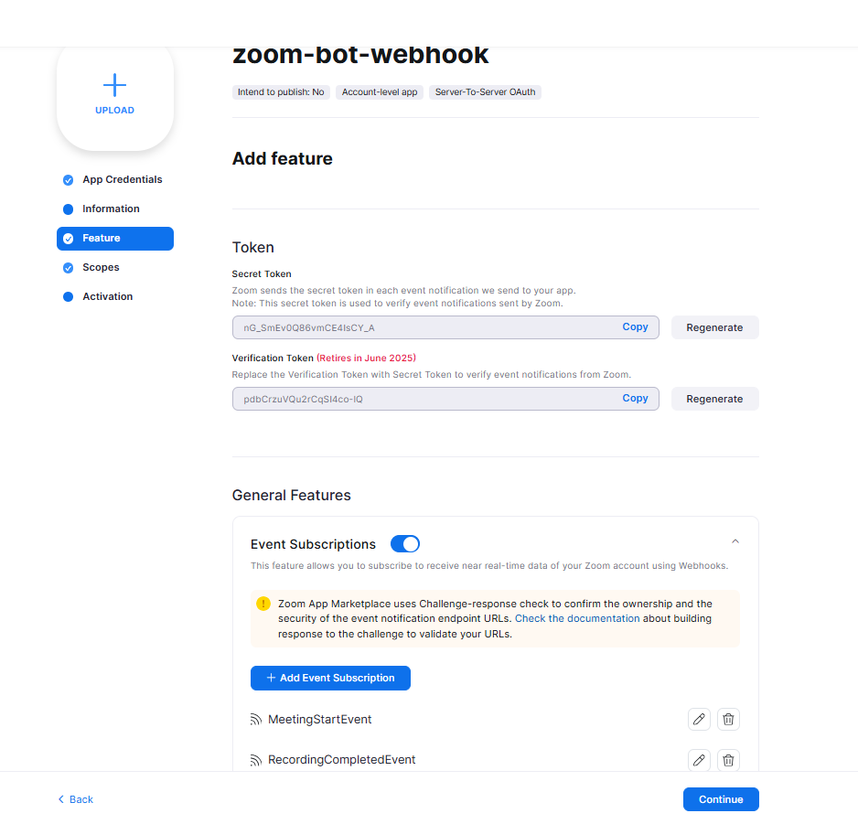
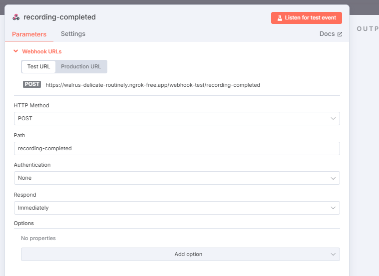
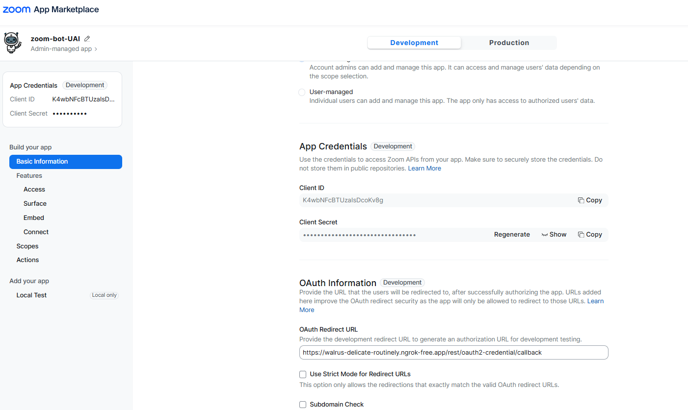
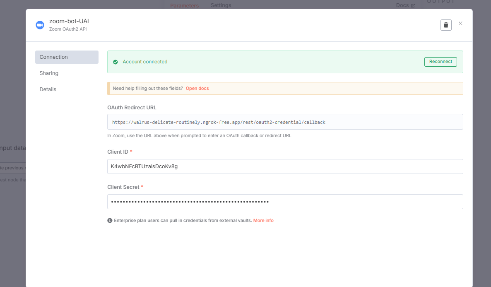
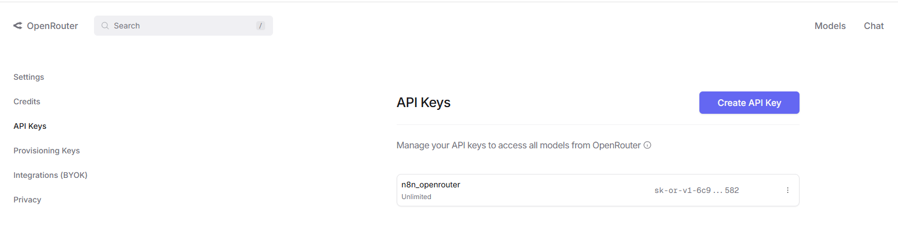
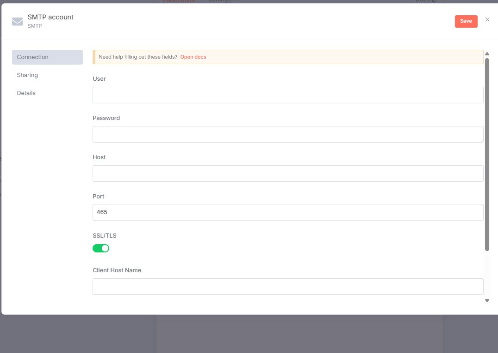

# 📘 Guía de Configuración Inicial para n8n + Zoom + Gmail + OpenRouter

---

## 🔑 1. Acceso a una cuenta de Ngrok

Para obtener el **authtoken** y habilitar una **API estática temporal**, accede al siguiente enlace:

👉 [https://dashboard.ngrok.com/get-started/setup/windows](https://dashboard.ngrok.com/get-started/setup/windows)

---

## 🌐 2. Webhook desde la App de Zoom hacia n8n

La **App Webhook de Zoom** permite emitir señales hacia n8n. Asegúrate de que n8n esté a la escucha en los endpoints configurados:

### 🧩 Webhook configurado en Zoom:

### 📡 Señal recibida por n8n:

---

## 🧠 3. App General de Zoom

La **App General de Zoom** te permite acceder a datos relevantes gracias a los permisos otorgados:

### 🔍 Vista en el panel de Zoom:

### 🧰 Conexión con n8n:

---

## 🔓 4. Acceso a la API Key de OpenRouter

Para usar OpenRouter como proveedor LLM, accede a tu clave API:

🔗 [https://openrouter.ai/settings/keys](https://openrouter.ai/settings/keys)

### 📸 Panel de configuración de OpenRouter:

#### modelo gratuito recomendado: `qwen/qwq-32b:free`

---

## ✉️ 5. App Password de Gmail para acceso SMTP

Configura el envío de correos desde n8n con Gmail usando una App Password:

🔗 [https://myaccount.google.com/u/1/apppasswords](https://myaccount.google.com/u/1/apppasswords?hl=es_419&utm_source=OGB&utm_medium=act&gar=WzEyMF0&pli=1&rapt=AEjHL4MDZMyv90LBy-ABp6e7EbI5Djd1eUdelfgRji265aEkWvHFhznP-LlST1l9BFQ9dGxfH-VxMcWB4POGqYGfqtXYr-5FuahkelWF1c0z53M0GjIWNJo&pageId=none)

### 📧 Configuración del SMTP:

#### 🛠 Parámetros de conexión:

- **User:** tu correo Gmail (ej: `tucorreo@gmail.com`)
- **Password:** la App Password generada (NO tu contraseña real)
- **Host:** `smtp.gmail.com`
- **Port:** `465`
- **SSL/TLS:** ✅ Activo
- **Client Host:** dejar vacío o usar `localhost`

---

✨ ¡Listo! Con esta configuración puedes integrar Zoom, Gmail y OpenRouter con n8n de forma segura y automatizada.
